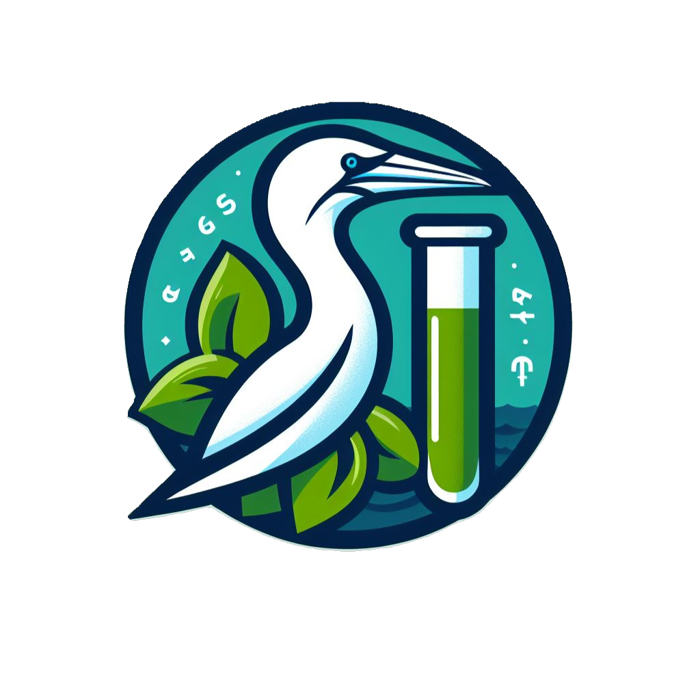

# plumesbox 

[](https://github.com/ECCC-lavoie-ecotox/plumesbox/actions/workflows/R-CMD-check.yaml)
[](https://lifecycle.r-lib.org/articles/stages.html#experimental)

Nothing fancy here, plumesbox gathers miscellaneous utils for data processing and statistical modelling in order to spend more time on the field. This toolbox is dedicated to help members of Lavoie's lab.

## Installation

You can install the development version of plumesbox from [GitHub](https://github.com/) with:

``` r
# install.packages("devtools")
devtools::install_github("ECCC-lavoie-ecotox/plumesbox")
```

## Launch the Shiny app

```r
plumesbox::run_app()
```

## Read the documentation

All functions are documented at this address: https://eccc-lavoie-ecotox.github.io/plumesbox

## Reloading a Shiny application on source changes

Install the following aptitude libraries

```bash
sudo apt-get install ruby
sudo apt-get install ruby-dev
sudo gem install bundler
```

Install gems

```bash
bundle install
```

Start application and watch files in R folder

```bash
bundle exec guard
```

## TODO: Steve 

- Ajuster les dates de collections des échantillons en fonction de ceux de minamata
- Ajouter les données corriger par Roxane
- Ajouter les dates manquantes manuellement dans la base de données
- Mieux documenter la procédure d'importation des données

On se garde 1 heure pour ajouter les coordonnées des sites et corriger les unités

